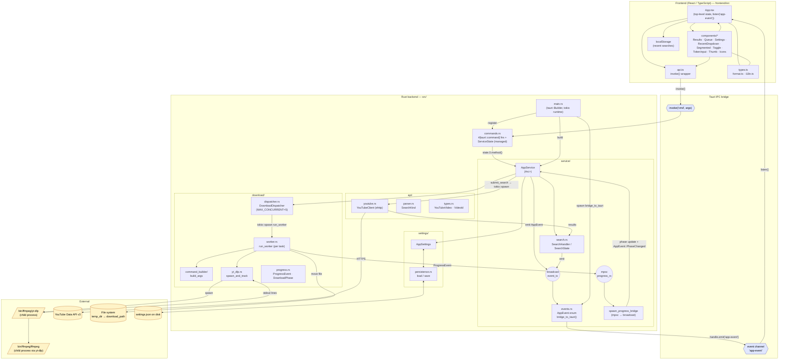

# Component Communication — yt-downloader

Tauri 2 desktop app. React/TS frontend in `frontend/src/`, Rust backend in `src/`.
Two channels cross the IPC boundary:

1. **Frontend → Backend**: `invoke("cmd_name", args)` → `#[tauri::command]` in `src/commands.rs`.
2. **Backend → Frontend**: `AppEvent` broadcast bus → `bridge_to_tauri` → `emit("app-event", …)` → `listen("app-event", …)` in `App.tsx`.

External processes (`yt-dlp`, `ffmpeg`) and the YouTube Data API sit outside the app boundary.

## Flowchart

## Communication summary per component

| Component | Talks to | Mechanism |
|---|---|---|
| `App.tsx` / components | `api.ts` | direct TS call |
| `api.ts` | Tauri core | `invoke<T>(cmdName, args)` over IPC |
| `App.tsx` | Tauri events | `listen("app-event", cb)` (`APP_EVENT_CHANNEL`) |
| `commands.rs` | `AppService` | method call through `State<ServiceState>` |
| `AppService` | `SearchHandler`, `DownloadDispatcher`, `AppSettings` | direct call inside `Arc<Mutex<Inner>>` |
| `AppService` | subscribers | `tokio::sync::broadcast<AppEvent>` (cap 256) |
| `YouTubeClient` | YouTube Data API v3 | HTTPS via `ehttp`, spawned on tokio |
| `DownloadDispatcher` | `run_worker` | `tokio::spawn` per worker, round-robin job buckets |
| `run_worker` → progress bridge | `AppService` | `tokio::sync::mpsc<ProgressEvent>` (cap 256) |
| progress bridge → frontend | `Events::bridge_to_tauri` | rebroadcast as `AppEvent::PhaseChanged`, then `emit("app-event")` |
| `yt_dlp.rs` | `yt-dlp` binary | child process; parses stdout into `DownloadPhase` |
| `yt-dlp` | `ffmpeg` | child process (merge/remux) |
| `worker.rs` | filesystem | move temp file → `settings.download_path` |
| `settings::persistence` | disk | `settings.json` load/save on startup + on `update_settings` |
| `App.tsx` | browser | `localStorage` for recent searches |

## Event taxonomy (`AppEvent`)

`SearchSubmitted` · `SearchResolved` · `SearchCleared` · `AutoDownloadStarted` ·
`PhaseChanged` · `DownloadRejected` · `SelectionToggled` · `SettingsUpdated`.
All past-tense facts, serialized as `{ kind, …fields }` (camelCase).
